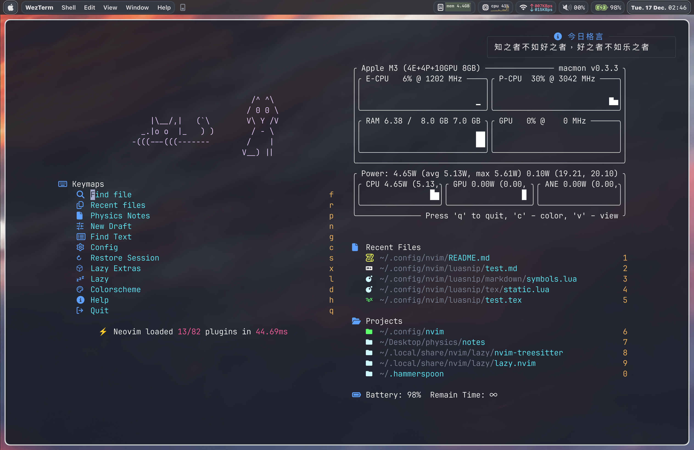
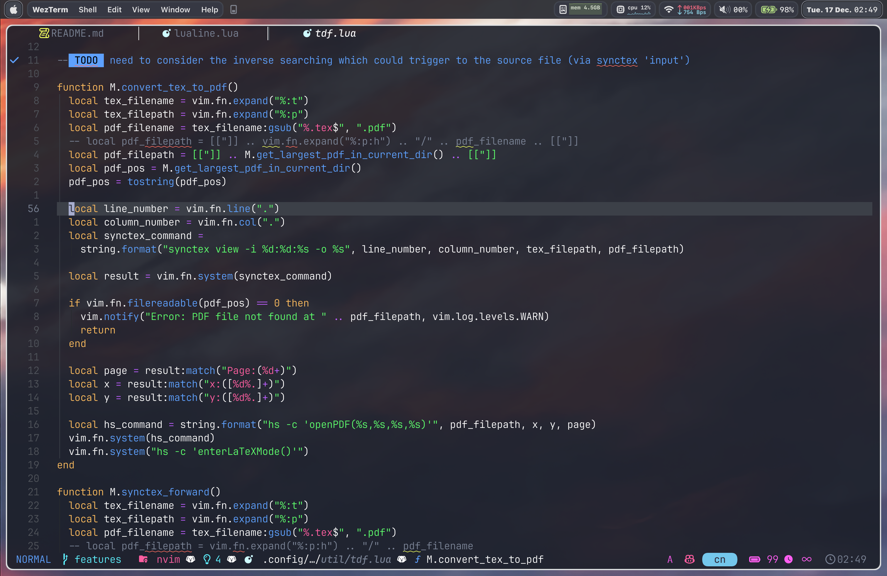
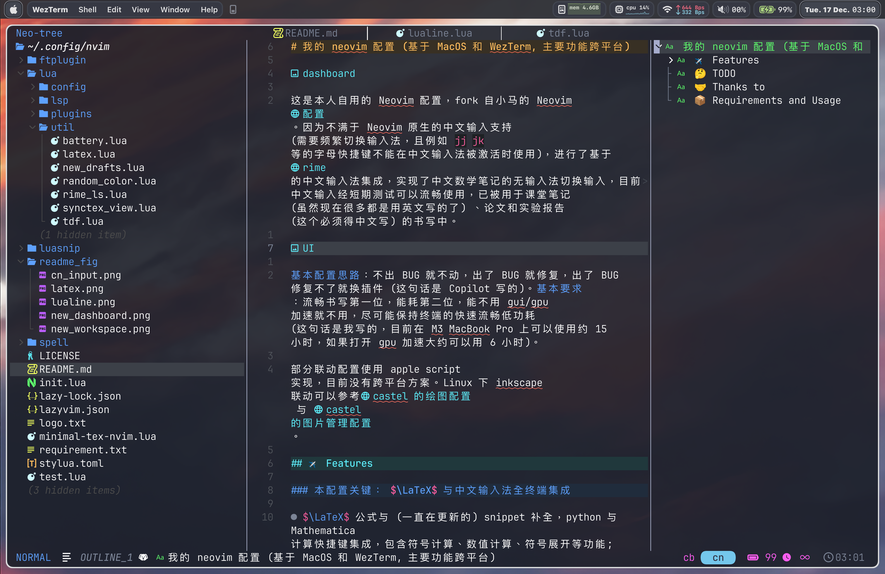
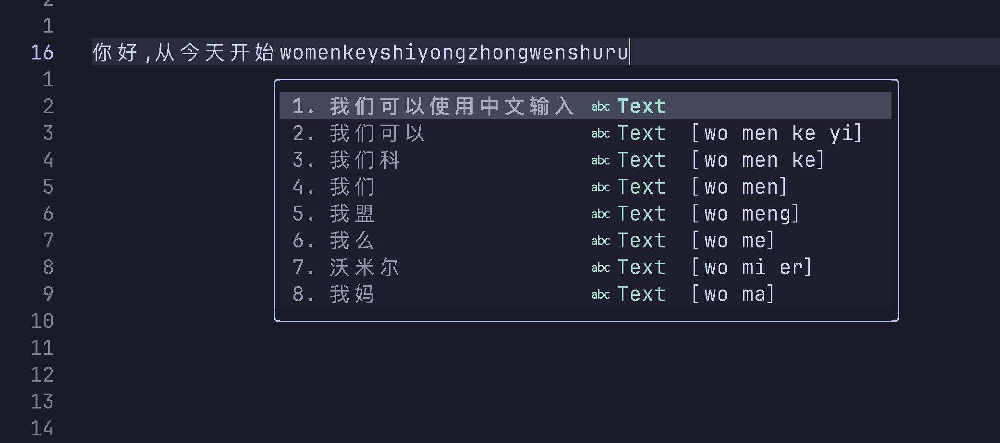
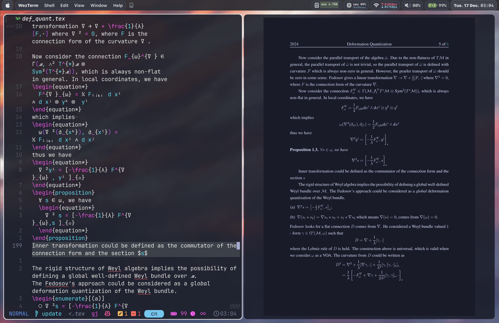
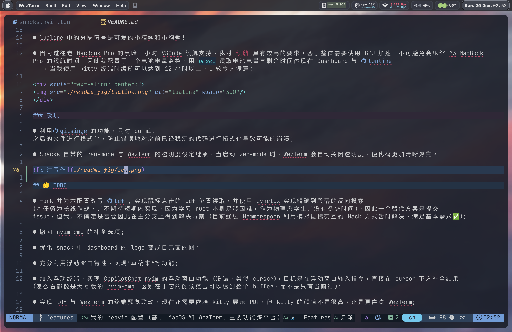
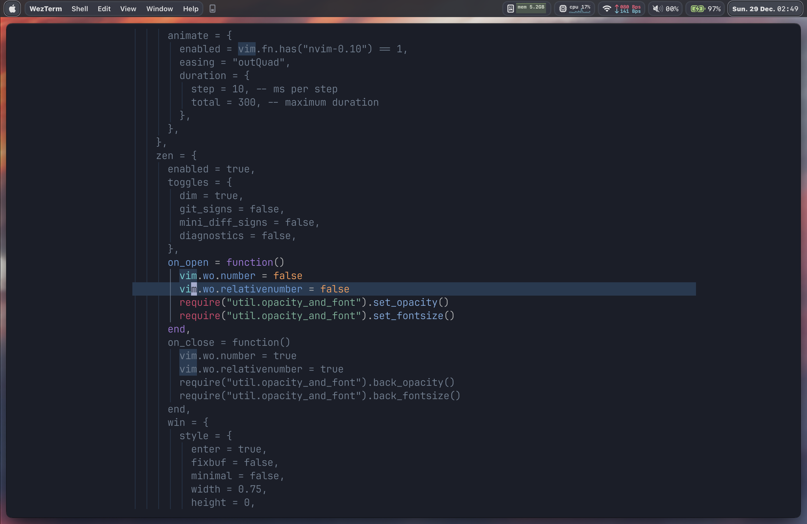

# 我的 neovim 配置 (基于 MacOS 和 WezTerm, 主要功能跨平台)



这是本人自用的 Neovim 配置，改变自本人原本的配置[MACOS_nvim_config](https://github.com/pxwg/MACOS_nvim_config)。

因为不满于 Neovim 原生的中文输入支持 (需要频繁切换输入法，且例如 `jj` `jk` 等的字母快捷键不能在中文输入法被激活时使用)，进行了基于 [rime](https://github.com/rime) 的中文输入法集成，实现了中文数学笔记的无输入法切换输入，目前中文输入经短期测试可以流畅使用，已被用于课堂笔记 (虽然现在很多都是用英文写的了) 、论文和实验报告 (这个必须得中文写) 的书写中。

因为不满于[nvim-cmp](https://github.com/hrsh7th/nvim-cmp)在 rime-ls 下潦草的性能，转向[blink-cmp](https://github.com/Saghen/blink.cmp) 。因为 blink-cmp 的配置几乎是从头再来 (尤其是考虑到我许久未更新的 LazyVim), 因此直接重写配置文件，完全支持新一代 neovim 配置。

> blink 相对于 nvim-cmp 有很多独特的好处，首先是运行速度确实很快，高速输入 (尤其是高速输入 rime_ls) 的时候不会出现卡顿和画屏现象，这是我选择它的主要原因。但是很明显，这个还是一个全新的方案，存在诸多问题。一个比较严重的问题是 copilot 会爆炸。不过问题也不是特别大，已经满足日常使用，最重要的是快呀，生活质量大大改善。





* 基本配置思路：专注速度，多语言输入与性能。不满足于简单的解决方案，而是尽可能面向未来组织功能设计;

部分联动配置使用 apple script 实现，目前没有跨平台方案。Linux 下 inkscape 联动可以参考[castel 的绘图配置](https://github.com/gillescastel/inkscape-figures) 与 [castel 的图片管理配置](https://github.com/gillescastel/inkscape-shortcut-manager)。

## ✈️  Features

### 本配置关键： $\LaTeX$ 与中文输入法全终端集成

* 基于 LSP [rime-ls](https://github.com/wlh320/rime-ls) 的中文输入法，自动匹配数学公式 (基于 [treesitter](https://github.com/nvim-treesitter/nvim-treesitter)) 转换为英文输入法，在英文输入环境中匹配数学公式并不切换输入法，实现中 - 英 - $\LaTeX$ 的完全集成，并通过合理的配置优化文件编辑速度 (具体而言，只在 insert 模式进行 lsp 触发)，最大限度保持了浏览文件过程中的跳转速度;利用相同原理配置了 markdown 的中文输入与 $\LaTeX$ 环境识别;

* 利用 [autoformat](https://github.com/huacnlee/autocorrect) 实现中文标点自动格式化 (对 latex 与 markdown 开启，在应用端修正了上游 formatter 的添加空行问题)，利用 [jieba](https://github.com/fxsjy/jieba) 实现中文分词，部分使用 hack 的方式解决了上游以及自动格式化的一些问题;



* iTerm2 / kitty 终端下的 pdf 终端预览，基于 [tdf](https://github.com/itsjunetime/tdf) 阅读器与 GPU 加速，允许利用快捷键 `<localleader>lf` 实现精确到*字符*的正向查找，触发 Hammerspoon 模式并直接点击 pdf 的特定位置可以实现精确到*段落*的反向查找，利用 [Hammerspoon](https://www.hammerspoon.org/) 与 synctex 实现。纯终端配置的优点在于不需要打开 GUI，可以在终端下进行快速预览并且省电，在本配置下可以实现几乎与 GUI 一样的预览效果。反向查找可以精确到 input 的源文件，例如，我在文件中 `input{}` 了一个文件，可以直接跳转到该文件的对应位置，这个功能在实验报告中意义重大，因为常常会在 `main.tex` 之中 `input` 很多表格类文件;



* OS X 环境下的 [inkscape](https://inkscape.org/) 集成，实现 latex 文档编辑时的图片绘制快捷键调用，利用 AppleScript 实现。在存在 ipad 分屏的时候优先跳转到 ipad 分屏的 inkscape 窗口进行手绘，在不存在 ipad 分屏的时候跳转到 macos 的 inkscape 窗口进行绘图，利用 [SizeUp](https://www.irradiatedsoftware.com/sizeup/) 的 AppleScript 接口实现窗口管理;

### 智能计算器集成

* $\LaTeX$ 公式与 (一直在更新的) snippet 补全，python 与 Mathematica 计算快捷键集成，在 LaTeX  源码中直接加载脚本，包含符号计算、数值计算、符号展开等功能，部分功能集成到性能更好且兼容性更强的[sniprun](https://github.com/michaelb/sniprun) 插件中 (这个插件允许划词运行代码段，我不喜欢它 default 的配置，因此在本配置中修改了其 TUI);

>基本逻辑：使用's' 触发所有的补全功能，使用; 'p' 或'm' 触发指定的快捷键功能，利用'cal' 或'ex' 触发符号计算与符号展开功能，使用切换节点功能`<C-h>` 可以跳转不同的脚本！

* 构建在 Mathematica notebook 文件`.nb` 中运行的 LSP，结合 sniprun 抛却颜值与操作性奇低的 Mathematica notebook，实现科学计算一把梭，并且可以实时保存 Mathematica 的计算结果方便后续查阅;

* 利用快捷键`<C-m>` 唤出浮动窗口写入 Mathematica 代码，利用 sniprun `<leader>cr`运行，实现利用 Mathematica 作为科学计算器辅助论文写作。

* 彩蛋用法：通过`setfiletype xxx` 的 vim 命令，这个浮动窗口事实上可以运行任意的代码，包括一些快速的代码实验！

### ai 辅助编辑

* 将 rime_ls 与 [copilotchat.nvim](https://github.com/CopilotC-Nvim/CopilotChat.nvim) 插件集成实现中文输入 (维护了一个 fork 以实现对其的兼容，在主分支中这个集成已经被弃用);

* 仿照 [curor](https://www.cursor.com/) 的设计，实现 copilotchat.nvim 的代码片段在所需 buffer 中直接替换，目前还集成了代码块快速跳转功能，比如说这一个代码块
```python
print("hello world")
# 这是一个代码块
```
直接输入快捷键 `<leader>ag` 就可以跳转到这个代码块并选择。这个操作的设计是为了和 copilotchat.nvim 配合使用，可以实现代码块的快速选取，并利用快捷键 `<leader>ai` 或 `<leader>aI`快速补全到正文文本之中，这两个快捷键的区别在于一个插入到正文所选文本之后不会返回 copilotchat.nvim 的 buffer，另一个会返回;同时还添加了`<leader>an`在所选文段以下插入代码块，用来适应告诉 GPT 你的函数，让他生成一个类似函数的工作情形。copilotchat.nvim 本身自带了一套快捷键`<C-y>` 与 `gd` 来分别更新代码与查看代码变化，但原本的快捷键不是特别灵活，故设计了上述快捷键;

* 为了集成上述七扭八歪配置做出了一系列反人类举动，通过配置加载序列目前在 M3 MacBook Pro 上的启动速度稳定在 35ms 左右;

~~你说得对，但是 neovim 是一款开源 (迫真) 的开放世界 (迫真) 游戏，在这里你将扮演 root，导引 lua 之力，与一系列 readme 一行，没有 doc 的插件斗智斗勇，并在*解决插件冲突*的过程中逐渐发掘 **VScode** 的真相~~

### UI 美化

* [snacks](https://github.com/folke/snacks.nvim) Dashboard 的 logo 是我和女朋友的互称，即猫猫狗狗。目前选自 [ASCII 狗狗图](https://www.asciiart.eu/animals/dogs) 与 [ASCII](https://www.asciiart.eu/animals/cats)，以后想要转换成自己画的图;

* 配备环境检测输入法状态栏，如果输入法自动切换功能失效，则会在正常输入环境中现实 error，提醒用户切换输入法，其他状态栏包括 `text` 环境与 `math` 环境，对应正常输入与公式 / 表格/ 图片输入两类模式，基于[treesitter](https://github.com/nvim-treesitter/nvim-treesitter) 与一些 `if` 判断实现 ;

* lualine 中的分隔符号是可爱的小猫󰄛 和小狗󰩃 !

* 因为过往老 MacBook Pro 的黑暗三小时 VSCode 续航支持，我对 **续航** 具有较高的要求。鉴于整体需要使用 GPU 加速，不可避免会压缩 M3 MacBook Pro 的续航时间，因此我配置了一个电池电量监控，用 `pmset` 读取电池电量与剩余时间体现在 Dashboard 与 [lualine](https://github.com/nvim-lualine/lualine.nvim) 中，当我使用 kitty 终端时续航可以达到 12 小时以上，比较令人满意;

<div style="text-align: center;">

</div>

### 杂项

* 利用[gitsinge](https://github.com/lewis6991/gitsigns.nvim) 的功能，只对 commit 之后的文件进行格式化，防止错误地对之前已经稳定的代码进行格式化导致可能的崩溃 (目前这个功能还在 debug 之中，原本的逻辑非常令人不满意);

* Snacks 自带的 zen-mode 与 WezTerm 的透明度设定继承，当启动 zen-mode 时，WezTerm 会自动关闭透明度并增加字数，提升代码阅读速度 (不过如果遇到中文可能会慢一点，大概需要多那么两三秒才能完整渲染中文字符，这应该是 WezTerm 的问题)。




## 🤔 TODO

* 格式化 git-hunk，但逻辑不是简单地 conform git hunk 对应行的代码 (这会造成一些错误的格式化），而是先全部格式化，再将对应的格式化内容应用到 hunk 上，这样可以避免一些错误的格式化并且保护之前的 commit;

* 优化 snack 中 dashboard 的 logo 变成自己画的图;

* 加入浮动终端，实现 CopilotChat.nvim 的浮动窗口功能 (没错，类似 cursor)，目标是在浮动窗口输入指令，直接在 cursor 下方补全结果 (怎么看都像是大号版的 nvim-cmp, 区别在于它的阅读范围可以达到整个 buffer，而不是只有当前行);

* 实现 tdf 与 WezTerm 的终端预览联动，现在还需要依赖 kitty 展示 PDF，但 kitty 的颜值不是很高，还是更喜欢 WezTerm;

* 增加 boostrapping 脚本，实现自动利用 Homebrew 安装依赖。

## 🤝 Thanks to

* [YinFengQi](https://github.com/YinFengQi) 我使用 Neovim 的动机来源于他的酷炫操作😲;

* [Kaiser-Yang](https://github.com/Kaiser-Yang) ，参考了 ta 的 rime_ls 配置;

* [Fireond](https://github.com/Fireond) ，参考了 ta 的 luasnip 配置;

* [castel](https://github.com/gillescastel) ，参考了他的 inkscape 配置，让我首次意识到原来 inkscape 可以这么用🤯。

## 📦 Requirements and Usage

* 安装：直接 clone 到 `~/.config/nvim` 即可，换言之，运行
```shell
git clone https://github.com/pxwg/MACOS_nvim_config.git ~/.config/nvim
```
打开 neovim 即可自动安装插件，需要进行版本管理的插件已经在 lazylock 中锁定，避免冲突;

* MacOS & WezTerm (你当然也可以用 iTerm，但是请自行修改双向查找对应的代码，zen-mode 的透明度集成也不能使用)，除了依赖 Hammerspoon 的终端 PDF 阅读器双向查找与部分性能检测 UI 外，其余功能均可在其他平台使用;

* neovim v0.9.5+ 或 v0.11.0 (nightly)，请**不要**使用稳定发行版 v0.10.x，因为会出现 LSP 通信的问题; LazyVim v13.0- (目前没有改变所有 api 以适应 Breaking Update 的癖好，虽然期中考试考完了但也没有这么多时间，因此 LazyVim 被锁定在 v12.44.1, LazyVim 不需要下载，因为本配置文件会自行 boostrap 它);

* 可以使用 brew 安装的 hub, *tdf*, *inkscape*, skim, SizeUp, rimels, autocorrect。其余 neovim 插件可以在配置中自行安装;

* 利用类似 `install_name_tool -add_rpath /usr/local/lib /path/to/your/rime_ls` 的方式让 *rime_ls* 找到其依赖库; 

* (可选) 在用户下新增文件~/quotes.txt，在其中添加你喜欢的格言，一行一条格言，将会在启动时随机输出。
